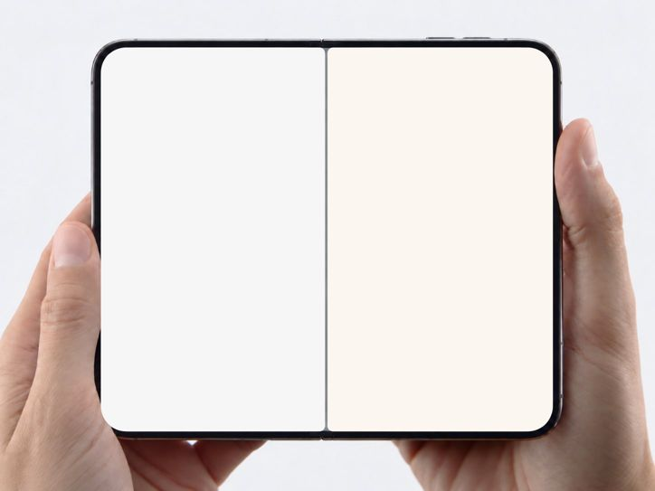

# Duo

One fixed 1448×1086 @ 30fps composition: a photo of two hands holding an open
foldable, with both screens blanked. You fill the two screen slots with HTML
(live video, a mock chat, a scrolling feed, anything HyperFrames renders) and
the rig masks it to the phone's true rounded-corner geometry.



**The phone and hands are a photograph, not something you build.**
`assets/plate.png` IS the device. Never recreate, redraw, or CSS-model the
foldable, its bezel, the hinge, or the hands, and never substitute a different
image. `build.mjs` copies the plate into every project; if it is missing, stop
and reinstall the skill rather than improvising a phone.

**Do not edit the rig.** The two `.screen` rects, their corner radii and the
hinge divider were measured from that photo pixel by pixel. Every visual change
you make happens inside `#screen-left .content` and `#screen-right .content`,
plus the one shared GSAP timeline.

## When to use / when not to

- Use for any "two things side by side on a phone" beat: app vs app, feed vs
  feed, two chats answering the same prompt, two versions of a product.
- Do not use when the user wants a single phone, a laptop, or a real device
  bezel they supply — this skill is one specific photo. For a different device
  plate you would re-measure geometry the same way (see
  `references/screen-geometry.md`) rather than stretch this one.

## Requirements

- Node 18+ and the HyperFrames CLI via `npx hyperframes@latest` (`@latest` is
  mutable; pin a version for byte-identical re-renders).
- Load your motion doctrine first if your workspace has one. The rig's only
  built-in motion is one slow camera push; everything inside the screens must
  perform (scrolls, swipes, typing, taps), never idle-wobble.

## Network and side effects (complete list)

- `registry.npmjs.org` — the HyperFrames CLI itself, via `npx`.
- `cdn.jsdelivr.net` — the composition loads GSAP (pinned `3.14.2`) at
  preview/render time. Rendering is not fully offline.
- Anything YOU add to the screens (video clips, avatars, fonts) is your side
  effect: fetching a site, downloading media, or scraping UI happens only if the
  user's request calls for real content, and only from sources they are entitled
  to use. `references/sourcing-real-ui.md` documents how, and the rights caveat.

No credentials, no paid operations, no telemetry. `build.mjs` writes only
inside `--out` and refuses to write through symlinks.

## Flow

`<SKILL_DIR>` is this skill's installed directory (e.g.
`~/.claude/skills/duo`).

1. **Scaffold** a project:

```bash
node <SKILL_DIR>/scripts/build.mjs --out ./foldable-meme --duration 10 --icons tiktok,instagram
```

   `--icons` is optional; it copies the real TikTok / Instagram glyph sheets
   (`assets/icons-*.svg`, extracted from the live mobile sites) into the project.

2. **Decide what each screen does** for the length of the clip, in writing,
   before touching HTML. The pause test: at any second, something inside at
   least one screen must be mid-motion (a swipe landing, a video playing, text
   arriving). Two static screenshots is not a video.

3. **Author the screens.** Inside each `.content` you have a normal DOM
   viewport: left `495×849`, right `498×849`. Position against those, never the
   root. Patterns (full-screen snap feed, drag→fling swipe, like-tap, chat
   typing) are in `references/feed-recipes.md`. Rules:
   - `<video class="clip" data-start data-duration muted playsinline>` for
     every clip; HyperFrames owns playback. Overlap the windows of an outgoing
     and incoming clip across a swipe so both are decoded mid-transition.
   - One timeline. Add your tweens to `tl` inside the marked hook; do not create
     a second `gsap.timeline` or register another `window.__timelines` key.
   - No `repeat: -1`, no `Math.random`, no clocks — the render seeks.
   - Status bar: the photo's original screens showed `9:41` top-left of the left
     screen and wifi/battery top-right of the right screen. Reproduce that split
     if your apps show a status bar; it sells the "one device" read.

4. **Check and snapshot**:

```bash
npx hyperframes@latest check ./foldable-meme
npx hyperframes@latest snapshot ./foldable-meme --at 1,4,7 --no-end
```

   Lint must be 0 errors. Layout/contrast warnings about text passing under a
   fixed header, or white UI text over video, are expected for app UIs; read the
   frames instead and confirm (a) content reaches every rounded corner with no
   gap, (b) the gray hinge divider is visible between the screens, (c) nothing
   from one screen leaks over the hinge.

5. **Render** only when the user asks (ask first if your harness gates renders):

```bash
npx hyperframes@latest render ./foldable-meme -o ./foldable-meme/renders/v1.mp4
```

## Verify success

`check` passes lint with 0 errors; `snapshot` frames show both screens filled
edge to edge inside the phone with the divider intact; the MP4 is the requested
duration at 1448×1086 and, on a pause at any second, something on screen is
moving. Pull frames from the rendered MP4 (not the preview) for the final QC.

## Rules

- Never resize, move, or re-radius the screens to "fit" content. Fit content to
  the slots. If a mock app looks too big, scale the app's internal type, not the
  screen.
- Real content must be real: if the user asks for TikTok or Instagram, pull the
  actual UI glyphs and layout metrics from the live site and use real posts
  (with their real usernames and counts), not invented ones. Invented handles
  are only for fictional / parody screens the user explicitly wants.
- Keep the camera push as the only rig motion. Do not add drift, breathe, or
  glow loops anywhere; fill time with story inside the screens instead.
- Output stays 1448×1086 (the plate's native 4:3). Offer a 16:9 or 1:1 crop as a
  follow-up render rather than resizing the rig.

## Files

- `assets/plate.png` — the clean plate, screens blanked to neutral (1448×1086).
- `assets/screen-spec.json` — measured rects, radii, hinge, status-bar split.
- `assets/icons-tiktok.svg`, `assets/icons-instagram.svg` — `<symbol>` sheets of
  the real mobile-web glyphs (like, comment, share, nav bars…).
- `template/index.template.html` — the locked rig with two empty slots.
- `scripts/build.mjs` — scaffolder.
- `references/screen-geometry.md` — how the geometry was measured and how to
  re-measure for a new plate.
- `references/feed-recipes.md` — snap feed, swipe physics, like tap, chat typing.
- `references/sourcing-real-ui.md` — pulling real app UI and clips, and the
  rights caveat.

## Provenance and licensing

- The plate is derived from a photo posted publicly on X by @A_Kapustin
  (status `2097769962936868872`, a foldable showing ChatGPT and Claude side by
  side); the two screens were blanked so it can carry any content. It is
  redistributed here as a meme template; users of this skill publish results at
  their own judgment and should credit the source where appropriate.
- The icon sheets reproduce TikTok's and Instagram's own UI glyphs (extracted
  from their public mobile web DOM) so mock screens look like the real apps.
  They are trademarks of their owners and are included for parody / commentary
  use only.
- GSAP is loaded from jsDelivr under its standard license; it is not vendored.
